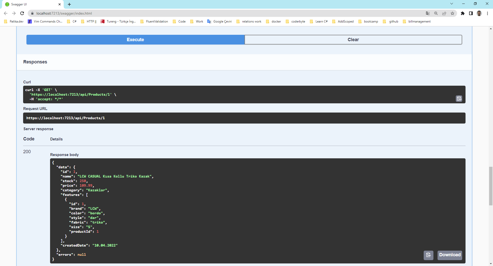

## LC Waikiki .Net Bootcamp [2.7]
`LC Waikiki .Net Bootcamp'in` birinci haftasında geliştirilen `örnek WebAPI projesi`

* Temel CRUD işlemleri, validasyonlar ve HTTP response status code'lar üzerinde durulmuştur.
* Ödevin isterleri dolayısıyla katmansız bir mimari inşa edilmiş ve bazı best practice'ler göz ardı edilmiştir.
* Seed Data configure edilirken LC Waikiki'nin sitesinden yararlanılmıştır.


### DELETE api/products/{id}

``` negatif id denemesi ```


### DELETE api/products/{id}

``` veritabanında olmayan id denemesi ```


### DELETE api/categories/{id}

``` kategori silme işlemi kısıtlandı ```


### GET api/products/{id}

``` opsiyonel → tek bir ürünü bütün detaylarıyla görmek ```



### POST api/products

``` validasyonlardan geçmeyen bir ürün ekleme işlemi ```


